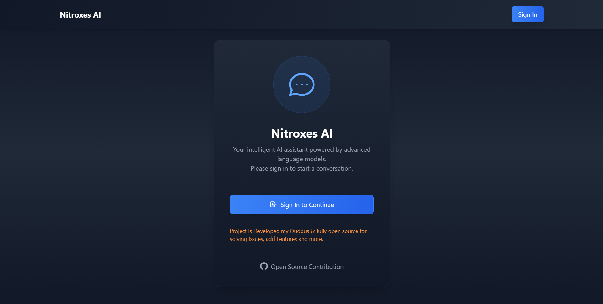
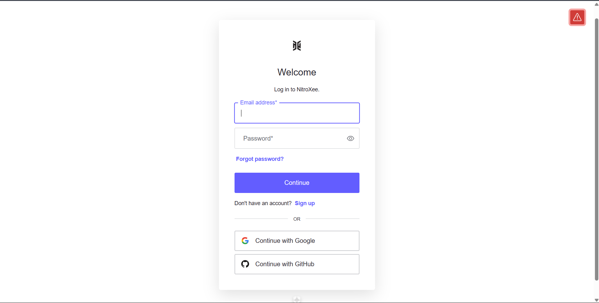
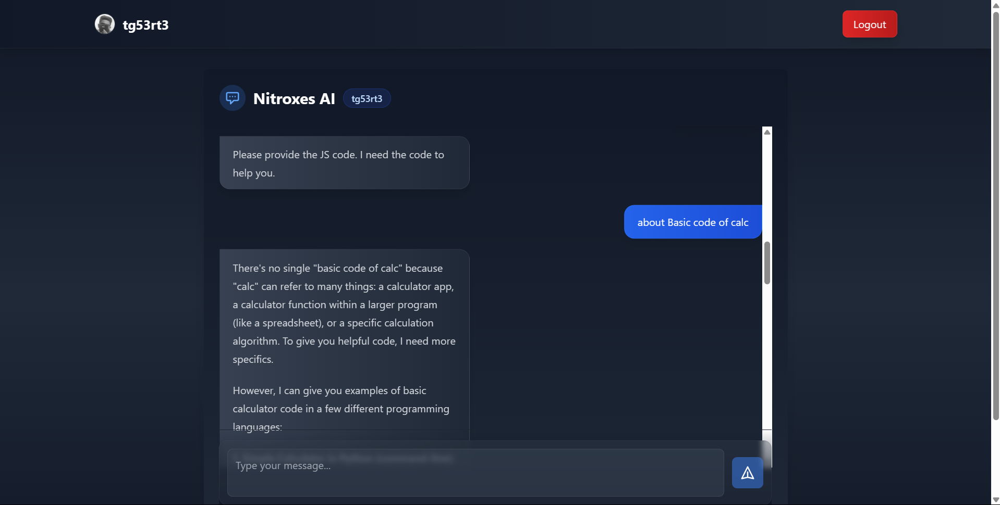

# AI Chatbot Application  

This AI chatbot is a **React-based** application that utilizes **[Google Gemini APIs](https://ai.google.dev/)** for generating responses. It features **[Auth0](https://auth0.com/)** authentication, ensuring secure user access. The project is managed on **[GitHub](https://github.com/)** for version control and collaboration.  

## 🚀 Features  

- **🤖 AI-Powered Responses**  
  Uses **[Gemini APIs](https://ai.google.dev/)** to generate relevant and intelligent replies.  

- **🔐 Auth0 Authentication**  
  Provides secure user login and authentication using **[Auth0](https://auth0.com/)** for controlled access.  

- **💾 Session-Based Storage**  
  Uses session storage to manage user interactions within a session.  

- **🎨 Basic UI/UX**  
  A simple, functional interface designed for usability over aesthetics.  

- **📂 GitHub Integration**  
  The project is structured for collaboration and version control on **[GitHub](https://github.com/)**.


This chatbot serves as a reliable AI assistant, leveraging **[Gemini API](https://ai.google.dev/)'s intelligence** and **[Auth0](https://auth0.com/)** authentication to deliver a secure and interactive experience.  

## snapShots
#### Home Page

#### Login page

#### Primary Page



## Build With Vite + TS + Rust comipiler
The Project Developed With High performance Vite React Faramework.

#### Client 
Simple AI system request response Web handle RESTAPIs.

#### Server
Faster Server Response Build With Node FrameWork ExpressJS. <br/>
**Requirements**
- Express
- dotenv
- mongoose (DataBase)

## Setup Project
#### **Requirements**
- NodeJS v18+
#### **React Packages**
- Tailwindcss (css writing) v3 
- React Markdown
- Axios (API handling)
- Auth0

**Clone The Git Repo**
```bash
git clone https://github.com/EnderTonol/Nitroxes.ai.git
```
**Install required packages in Both Backend & Frontend**
```bash
npm install 
```
**Run Client(Front-end) >** 
`npm start`
<br/>
**Run Server(Back-end) >**
`npm start`

### Note: It is not Deployed For Live Preview! to avoid Error due to Express Server


